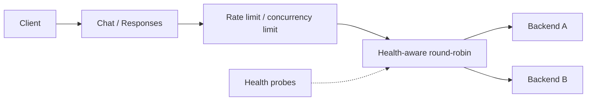

<a id="readme-top"></a>

<div align="center">
  <h1>InferGate</h1>
  <p>An async HTTP gateway for LLM backends.</p>
  <p>
    <a href="docs/README.md"><strong>Documentation</strong></a>
    &middot;
    <a href="docs/ARCHITECTURE.md">Architecture</a>
    &middot;
    <a href="docs/BENCHMARKS.md">Benchmarks</a>
    &middot;
    <a href="https://github.com/Zemaokk/infergate/issues">Report an issue</a>
  </p>
</div>

<details>
  <summary>Table of contents</summary>

- [About the project](#about-the-project)
- [Getting started](#getting-started)
- [Usage](#usage)
- [Tests and benchmarks](#tests-and-benchmarks)
- [Project status](#project-status)
- [Contributing](#contributing)
- [Acknowledgments](#acknowledgments)

</details>

## About the project

InferGate sits between a client and one or more model servers. It routes
requests to healthy backends, limits incoming traffic, and forwards ordinary
and streaming responses. Both API endpoints use the same routing, quota, and
concurrency state.

The project focuses on what happens around a model call: what to do when a
backend stops responding, how long to hold a concurrency slot, and how to
account for a stream that sends HTTP 200 but fails before finishing.

- **Routing:** round-robin across healthy backends, with periodic probes to
  remove failed instances and restore recovered ones.
- **Admission:** per-key token buckets and a global concurrency limit, with
  immediate rejection when capacity is exhausted.
- **Failure handling:** at most two backend attempts, with fallback restricted
  to connection-establishment failures. Opened streams are never replayed.
- **Observability:** request and backend-attempt metrics, JSON completion logs,
  and OpenTelemetry spans correlated by trace ID.



For streaming requests, the response object owns downstream cleanup and slot
release once the endpoint hands it the opened stream. The slot stays occupied
until cleanup finishes. This includes cancellation and failures while sending
headers or body chunks. The [architecture guide][architecture] explains the
ownership rules and links to the tests.

### Built with

Python 3.13, FastAPI, HTTPX, and AnyIO form the gateway. Prometheus and
OpenTelemetry provide metrics and tracing; the local observation stack uses
Grafana and Jaeger. Docker Compose runs the demo.

Real-model integration was tested with Qwen2.5-7B-Instruct served by vLLM.
Model serving runs separately from the gateway.

## Getting started

### Prerequisites

- Docker Engine with Docker Compose for the demo.
- Python 3.13 and uv for native development and verification scripts.
  The recorded uv version is 0.12.2.

The demo uses two mock backends and needs no GPU. Port 8000 must be available.

### Installation

```sh
git clone https://github.com/Zemaokk/infergate.git
cd infergate
docker compose up --build -d --wait
```

The gateway listens on `http://127.0.0.1:8000`. The backends are reachable only
inside the Compose network.

For a native Python setup, install the locked environment:

```sh
uv sync --locked --no-editable
```

Then follow the [native startup instructions][usage] to run the two mock servers
and gateway in separate terminals. Use one gateway worker.

## Usage

Send a Chat Completions request:

```sh
curl -i http://127.0.0.1:8000/v1/chat/completions \
  -H 'Content-Type: application/json' \
  -H 'X-InferGate-Key: demo' \
  -d '{
    "model": "mock-model",
    "messages": [{"role": "user", "content": "hello"}]
  }'
```

The `X-InferGate-Backend` response header identifies the selected backend.
Successful requests rotate between A and B while both are healthy.

For a streaming response:

```sh
curl -N http://127.0.0.1:8000/v1/chat/completions \
  -H 'Content-Type: application/json' \
  -H 'X-InferGate-Key: stream-demo' \
  -d '{
    "model": "mock-model",
    "messages": [{"role": "user", "content": "hello"}],
    "stream": true
  }'
```

The mock sends one content event, waits briefly, then sends `[DONE]`.
Default admission limits are a burst of 2 requests per key, a refill rate of
1 request/second, and 2 concurrent downstream tasks. Excess traffic receives
429 for key limits or 503 for concurrency limits. Keys are caller-supplied
quota labels, not authentication credentials.

| Endpoint | Support |
| --- | --- |
| `POST /v1/chat/completions` | Text messages, ordinary responses, and SSE |
| `POST /v1/responses` | Text-only, non-streaming subset; explicit `store=false` |
| `GET /metrics` | Prometheus metrics; no key required |

Requests go to the same endpoint on the backend. Responses therefore requires
a server with native Responses support; the demo mocks only implement Chat.
See [API examples and backend configuration][usage] for supported fields and
how to connect an existing vLLM server.

The Prometheus, Grafana, and Jaeger services run in a
[separate observation stack][observation-stack]. The application Compose stack
does not start them or enable OTLP export. Its gateway health check tests
`/metrics` availability, not backend readiness.

Stop the demo with:

```sh
docker compose down
```

## Tests and benchmarks

With the Python environment installed:

```sh
uv run --no-sync python -m pytest -q
```

As of the 2026-10-08 acceptance, **435 tests pass**, covering validation, routing,
admission, fallback, stream cleanup, and observation lifecycles. [CI][ci] also
builds the Docker image and checks routing, SSE, backend recovery, and rejection
when all backends are unavailable. Linux ARM64 and AMD64 packaging results are
linked in the [acceptance record][acceptance].

The real-model benchmark compared direct and gateway access on one RTX 4090:
24 cases, three rounds, and 1,200 measured requests in total. All returned valid
model responses under the [experiment's criteria][benchmarks].

| Protocol | Concurrency | Direct req/s | Gateway req/s |
| --- | ---: | ---: | ---: |
| Chat | 1 | 0.890 | 0.888 |
| Chat | 2 | 1.710 | 1.710 |
| Responses | 1 | 0.879 | 0.877 |
| Responses | 2 | 1.674 | 1.674 |

These are median successful throughputs across three rounds. The workload used
a short repeated prompt, warm prefix cache, and a 64-token output cap.
The 1,200 requests include both direct and gateway measurements. Throughput was
comparable in this workload; long inputs, cold caches, and production load
were not measured.

![Direct and gateway throughput and latency][benchmark-plot]

The [benchmark guide][benchmarks] includes latency results, three-round ranges,
controlled local overload experiments, and links to raw records. To redraw the
saved data without a GPU or collect new measurements, see [Reproduction][reproduction].
GPU experiments are separate from CI.

## Project status

The current version runs in a single process. Multi-backend routing and fallback
were checked with controlled HTTP servers; real inference, SSE, and stop/recovery
were checked against a single vLLM backend.

Runtime state is local to one worker. There is no waiting queue, shared quota
across workers, key-state eviction, or total generation deadline. A stream
that keeps producing data, or a stalled downstream close, can retain a slot.
First-byte metrics measure backend body reads, not model TTFT.

Responses supports a small subset of the API, without tools, multimodal input,
conversation storage, or background execution. The recorded native Responses
validation used vLLM 0.10.1+cu118; the earlier Chat deployment used 0.8.5.
This repository has not been validated as a production service.

Current limits are documented in [Architecture][architecture]. The original
M0–M4 plans and dated records remain available through the
[documentation index][docs].

## Contributing

For a bug report, include the request, relevant configuration, observed result,
and a small reproduction. A trace ID or completion log is useful for lifecycle
and fallback issues; leave credentials and private request content out.

Keep changes focused and include a regression test for behavior changes.
For routing, admission, or streaming changes, explain the effect on state
ownership and failure handling. The [development records][docs] describe the
existing decisions.

Maintained by [Zemao Chen](https://github.com/Zemaokk).

## Acknowledgments

README structure adapted from [Best-README-Template][readme-template].

Zemao Chen led the core routing, health-state, admission, fallback, and
shared-execution implementations. AI tools helped with review, integration,
tests, deployment, benchmark design, and documentation. Details are in the
[collaboration record][collaboration] and [contribution summary][contributions].

<p align="right"><a href="#readme-top">Back to top</a></p>

[docs]: docs/README.md
[architecture]: docs/ARCHITECTURE.md
[usage]: docs/USAGE.md
[benchmarks]: docs/BENCHMARKS.md
[reproduction]: docs/REPRODUCING.md
[acceptance]: docs/PROJECT_ACCEPTANCE.md
[ci]: .github/workflows/ci.yml
[observation-stack]: observability/README.md
[benchmark-plot]: docs/M4/benchmark-real-20261007/real-comparison.png
[collaboration]: docs/COLLABORATION_CONTRACT.md
[contributions]: docs/PROJECT_ACCEPTANCE.md#作者理解与贡献记录
[readme-template]: https://github.com/othneildrew/Best-README-Template
