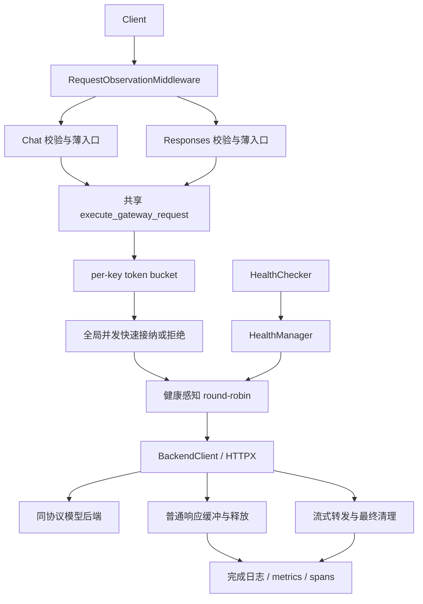

# 当前架构与请求路径

本文件描述 M4.5 时的实现；M0 目录保留的是历史设计。运行入口是
`infergate.runtime:app`，工厂为 `create_runtime_app()`。仅支持单 worker；
`infergate` console command 仍为占位问候命令，不用于启动网关。

## 模块、状态与所有权

| 模块 | 职责及状态 |
| --- | --- |
| `runtime.py` | app 创建时冻结模型、后端数量/地址及 OTLP 配置；持有两个 HTTP client 与健康探测生命周期 |
| `app.py` | 两种请求模型、薄入口、共享执行函数；普通与流式响应的资源责任交接 |
| `router.py` | 模型到后端列表、round-robin 游标；排除已尝试或不健康的后端 |
| `health.py` / `health_checker.py` | 按 backend ID 保存最近探测结果；启动及周期并行探测，轮次不重叠 |
| `token_bucket.py` | 每 key 的额度和最后补充时刻；容量 2、补充 1/s |
| `concurrency_limiter.py` | app 共享的占用计数；上限 2，没有等待队列 |
| `backend_client.py` | 原生 HTTP path/body 转发及传输错误分类；不负责 admission 或决定 fallback |
| `observability.py` / `metrics.py` / `tracing.py` | 每请求/每尝试观测、app 独立 registry/provider、完成日志、context 传播及可选导出 |

Chat 与 Responses 共用同一组资源，不各自复制配额或并发容量。
状态只在当前 app/进程中共享；启动多个 worker 会产生多套独立额度。
模型服务的线程、调度器与 KV cache 不属于网关状态。

## 请求、失败和清理

1. 观测中间件创建请求记录；框架先校验正文。非法正文返回 400、零次后端尝试，
   不进入共享执行函数，也不扣 key 额度。
2. 检查 key，再扣 per-key 额度，再获取并发名额。缺 key 为 400，额度不足
   为 429，并发已满为 503。并发拒绝已扣额度，后续失败或拒绝也不退费。
3. 根据模型与健康状态选路。起初无候选为 503；选中后端后才建立尝试记录。
4. 只在 ConnectError/ConnectTimeout 时 fallback，排除已尝试的 backend，
   最多两次。同一请求只扣一次额度、只占一个名额；尝试之间不释放。
   Read/Write/Pool 错误、后端 HTTP 错误及已开始的流不触发 fallback。
   传输失败后的无备用或次数耗尽仍返回 502。
5. 普通响应读完后缓冲返回，并发名额在向客户端发送前释放。
   流式响应由 `LimitedStreamingResponse` 接管，逐块透传；正常结束、异常、
   发送失败或取消都执行下游关闭和最终释放。关闭期间仍占用名额。
6. 中间件在响应执行与清理结束后定稿日志、指标和 span。HTTP 200 的流仍可能
   最终 cancelled/stream_error，不能只按状态码判定业务成功。

健康状态只是上次探测快照：后端停止但尚未更新时可能连接失败得到 502；
更新为不健康后才可能直接 503。恢复后的成功探测使其重新进入选路。

## 协议及可观测性边界

Chat 支持普通和 SSE；Responses 仅支持合同中的文本、非流式子集，显式
`store=false`，不支持会话存储、工具或多模态。二者都转发到后端相同 path，
没有协议转换。字段细则见 [Responses 合同](M4/RESPONSES_CONTRACT.md)。

完成日志不含 key、请求正文或异常文本。请求 span 下的每次尝试 span 是兄弟
关系；上游/后端未插桩时不会凭 context 传播自动生成对应 span。
读侧 first-byte 不是模型 TTFT；无队列故不报告等待队列时长；没有可信 token/s。

并发上限、每次 HTTP 超时及尝试次数有明确设置，但没有总生成 deadline；
持续输出的流和 shielded cleanup 仍可长期占用名额。key 状态字典没有数量
上限/淘汰，key 也是调用方自报的额度标识，并非认证。这些边界及现有测试
不支持“生产就绪”或“整体内存、请求总时长有界”的结论。
