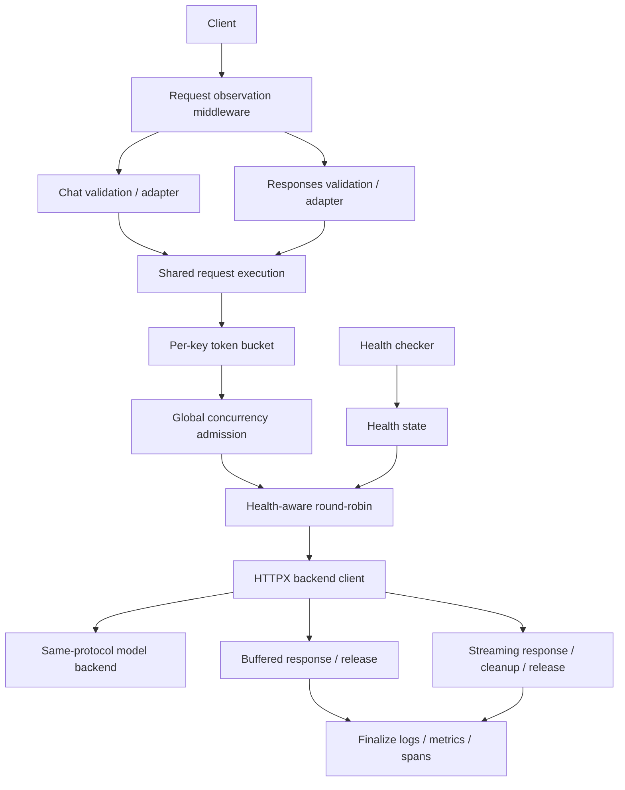

# Architecture and design decisions

[Documentation index](README.md) · [Usage](USAGE.md) · [Observability](OBSERVABILITY.md)

InferGate separates protocol adapters from routing, admission, backend transport,
and observation. The runtime entry point is `infergate.runtime:app`; the factory
is `create_runtime_app()`. The supported deployment uses one worker.

## Request path

The adapters supply the validated payload, model, backend path, and streaming
choice. They share one router, key limiter, concurrency limiter, backend client,
and observation lifecycle. Adding Responses did not create separate quotas or
capacity. Each request goes to the same protocol on its backend; the gateway
does not translate Responses into Chat.

## State and ownership

| Module | Responsibility and state |
| --- | --- |
| [runtime.py](../src/infergate/runtime.py) | Freezes model, backend count/URLs, and OTLP configuration at app creation; owns separate inference/probe HTTP clients and startup/shutdown |
| [app.py](../src/infergate/app.py) | Request models, thin adapters, shared execution, and buffered/streaming resource ownership |
| [router.py](../src/infergate/router.py) | Model-to-backend lists and round-robin cursors; filters unhealthy and previously attempted backends |
| [health.py](../src/infergate/health.py), [health_checker.py](../src/infergate/health_checker.py) | Last probe result per backend; parallel startup/periodic probes with nonoverlapping rounds |
| [token_bucket.py](../src/infergate/token_bucket.py) | Tokens and last refill time per key; default capacity 2, refill 1/s |
| [concurrency_limiter.py](../src/infergate/concurrency_limiter.py) | App-wide occupied capacity; default limit 2 and no waiting queue |
| [backend_client.py](../src/infergate/backend_client.py) | Same-protocol HTTP transport and retryable/nonretryable error classification |
| [observability.py](../src/infergate/observability.py), [metrics.py](../src/infergate/metrics.py), [tracing.py](../src/infergate/tracing.py) | Request/attempt observations, app-owned registry/provider, completion logs, context propagation, and optional export |

Mutable routing and limiter updates are synchronous and contain no `await`
inside their state transitions. They are used within the app's event loop;
this is not a thread-safe or cross-process coordination mechanism. Multiple
workers would create independent copies of these states.

## Design decisions

### Immediate admission instead of a waiting queue

A request passes body validation, key validation, key quota consumption, and
global concurrency admission in that order. Invalid bodies return 400 before
admission. Exhausted key quotas return 429; exhausted concurrency returns 503.
A concurrency rejection has already consumed key quota, and later failures do
not refund it.

The first version rejects excess work immediately rather than building a queue.
This makes admitted capacity explicit while leaving queue scheduling outside
the implementation. It does not bound every form of memory use or elapsed time.

### Transfer streaming resource ownership explicitly

For buffered responses, the endpoint owns the concurrency slot until the backend
body has been read. The slot is released before the buffered response is sent
to the client.

For streaming responses, the endpoint owns the slot and any opened downstream
stream until construction of `LimitedStreamingResponse` succeeds. The response
object then owns execution, downstream close, and slot release. Cleanup runs
even if sending headers fails before body iteration. Cancellation-shielded close
runs before release; the slot remains occupied during close. Construction failure
leaves cleanup with the endpoint.

The tests cover completion, read errors, client disconnect, cancellation, send
failure, close failure, and response-construction failure. See
[lifecycle tests](../tests/test_app.py) and [M2 acceptance](M2/ACCEPTANCE.md).
Shielding cleanup is a resource-management choice, not a total-time guarantee.

### Restrict fallback to connection establishment failures

Only HTTPX `ConnectError` and `ConnectTimeout` permit fallback. The request
excludes already attempted backends and makes at most two backend attempts.
It consumes quota and acquires capacity once, holding the slot between attempts.

Read, write, and pool errors, backend HTTP errors, and failures in an opened
stream do not trigger fallback. The gateway avoids replaying requests after
uncertain execution or after streaming has started. See
[retry tests](../tests/test_retry.py) and the [retry contract](M2/RETRY_CONTRACT.md).

### Treat health as a routing snapshot

Probes update stored state independently of in-flight requests. Startup probes
run in parallel; periodic probe rounds do not overlap. Runtime defaults are a
2-second probe deadline and a 5-second interval between completed rounds.

If initial routing finds no healthy candidate, the request returns 503 with
zero attempts. If connection establishment fails and fallback is unavailable
or exhausted, it returns 502. After a backend stops, either outcome can occur
depending on whether a probe has updated the snapshot. A successful probe
makes a recovered backend eligible again.

### Finalize observations after execution and cleanup

A request can contain multiple backend attempts. Each attempt gets its own
observation and CLIENT span; fallback spans are siblings under the request span.
Completion logs, metrics, and spans finalize after response execution and cleanup.

A stream can send HTTP 200 and later end as `cancelled` or `stream_error`.
Request outcome and HTTP status therefore remain separate. First-byte timings
observe nonempty downstream body chunks, not tokens or client receipt.
See the [observability reference](OBSERVABILITY.md).

## Current limits

- **Process scope:** one worker; no shared quotas or health coordination across
  processes. Caller-supplied keys are quota labels, not authenticated identities.
- **Resource bounds:** concurrency and attempt counts are limited, but the key
  dictionary has no eviction. Buffered bodies and overall memory are not bounded
  by admission alone.
- **Time bounds:** HTTP operations use timeouts (connect/pool 5s, write/read 30s),
  but there is no total generation deadline. A continuously producing stream
  or stalled shielded close can retain a slot.
- **Protocol scope:** Chat supports ordinary and SSE responses; Responses is a
  text-only, non-streaming subset with explicit `store=false`. There are no
  stateful conversations, tools, multimodal support, or protocol translation.
  See [API details](USAGE.md#api-requests).
- **Observation scope:** first-byte is not TTFT; no queue wait or reliable
  production token/s is measured. Backend internal scheduling and computation
  require backend instrumentation. OTLP delivery is best effort.
- **Validation scope:** controlled multi-backend behavior and real single-backend
  inference are separate checks. Long-running production stability, other
  routing policies, Kubernetes, and autoscaling were not evaluated.

The `infergate` console command remains a scaffold greeting; use the Uvicorn
entry point in [Usage](USAGE.md). Dated implementation and validation records
are indexed in [Documentation](README.md).
