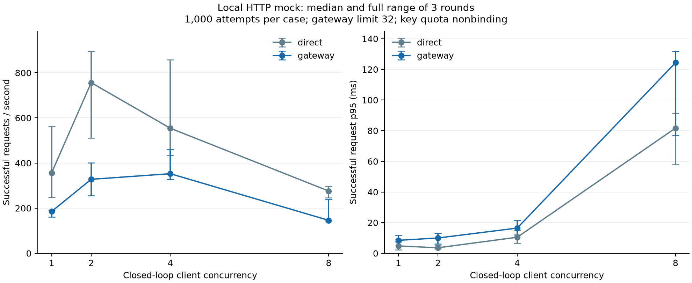

# M4.4 本地受控实验结果

本结果只适用于本机 HTTP mock，不能代表 GPU 推理性能。

- 平台：`macOS-27.0.1-arm64-arm-64bit-Mach-O`；Python `3.13.14`。
- 开始：2026-10-07T04:26:00.901418+00:00；结束：2026-10-07T04:40:56.548632+00:00。
- 52 个有效 case 通过行为及证据核对（补测情况见下文）。
- 数值为三轮中位值；方括号为三轮最小值至最大值，不是置信区间。

## 网关开销

每个入口/并发/轮次 1,000 次尝试，成功率均需单独核对。

| 并发 | 入口 | 成功率 | 成功 req/s [范围] | 成功 p95 ms [范围] |
| --- | --- | --- | --- | --- |
| 1 | direct | 100.0% | 356.5 [247.9, 562.2] | 4.81 [2.35, 8.81] |
| 1 | gateway | 100.0% | 185.3 [161.1, 192.5] | 8.47 [7.53, 11.86] |
| 2 | direct | 100.0% | 756.2 [511.5, 895.5] | 3.60 [2.97, 5.46] |
| 2 | gateway | 100.0% | 327.9 [255.0, 400.5] | 10.00 [6.23, 13.07] |
| 4 | direct | 100.0% | 554.0 [433.6, 857.0] | 10.47 [6.54, 14.98] |
| 4 | gateway | 100.0% | 352.7 [328.7, 459.2] | 16.45 [12.09, 21.32] |
| 8 | direct | 100.0% | 276.0 [246.3, 297.0] | 81.71 [58.00, 91.50] |
| 8 | gateway | 100.0% | 146.1 [144.5, 239.8] | 124.36 [76.90, 131.85] |

原始运行有以下无效 case；它们的全部记录保留，因预先定义的有效性规则
排除出性能汇总，并按相同参数补测。不是从有效轮次中挑选较快结果：

- `rate-r2-q2-k1`：arrival scheduler missed or delayed planned requests by >100ms；已发 59，漏发 1。
- `rate-r2-q5-k1`：arrival scheduler missed or delayed planned requests by >100ms；已发 148，漏发 2。

原始证据目录：`/Users/zemaochen/projects/infergate/artifacts/m4-benchmark/20261007-local-01`。

原始运行起点：2026-10-07T04:26:00.901418+00:00；本报告结束时间含补测。

## 流量保护

| 实验 | 负载 | key 数 | 成功率中位值 | 预期拒绝 |
| --- | --- | --- | --- | --- |
| rate | 每 key 0.5 req/s | 1 | 100.00% | 429 rate_limit_exceeded |
| rate | 每 key 1 req/s | 1 | 100.00% | 429 rate_limit_exceeded |
| rate | 每 key 2 req/s | 1 | 51.67% | 429 rate_limit_exceeded |
| rate | 每 key 5 req/s | 1 | 20.67% | 429 rate_limit_exceeded |
| rate | 每 key 2 req/s | 2 | 51.67% | 429 rate_limit_exceeded |
| waves | 每波 1 个 | 1 | 100.00% | 503 concurrency_limit_exceeded |
| waves | 每波 2 个 | 1 | 100.00% | 503 concurrency_limit_exceeded |
| waves | 每波 4 个 | 1 | 50.00% | 503 concurrency_limit_exceeded |
| waves | 每波 8 个 | 1 | 25.00% | 503 concurrency_limit_exceeded |

顺序验收另行验证：目标 key 得到并发 503、并发 503、key 429；拒绝尝试次数均为 0。
全部波次结束后 active=0，恢复请求成功；实际服务端额度时刻与 refill 规则及 HTTP 结果一致。

## 解释边界

该机器同时承担客户端、网关与后端，包含客户端调度、连接复用、HTTP、
日志和观测开销。零延迟 mock 对操作系统调度及后台活动敏感；三轮范围
可能较宽。端到端 p95 差异不能解释为每个请求的纯网关耗时，
也不能从某档吞吐直接外推生产容量。尚未获得真实模型性能数据。

## 原始证据

证据目录：`/Users/zemaochen/projects/infergate/artifacts/m4-benchmark/20261007-local-retry-01`。

包含 manifest、源码快照、逐次 requests.jsonl、missed.jsonl、逐 case JSON、
服务日志和 summary.json。预热排除；波次恢复请求单列；固定到达率的
吞吐窗口包含完整计划发送窗口及超出窗口的排空时间。补测报告需同时保留
原始证据目录与补测目录；合并汇总不复制原始请求和日志。
