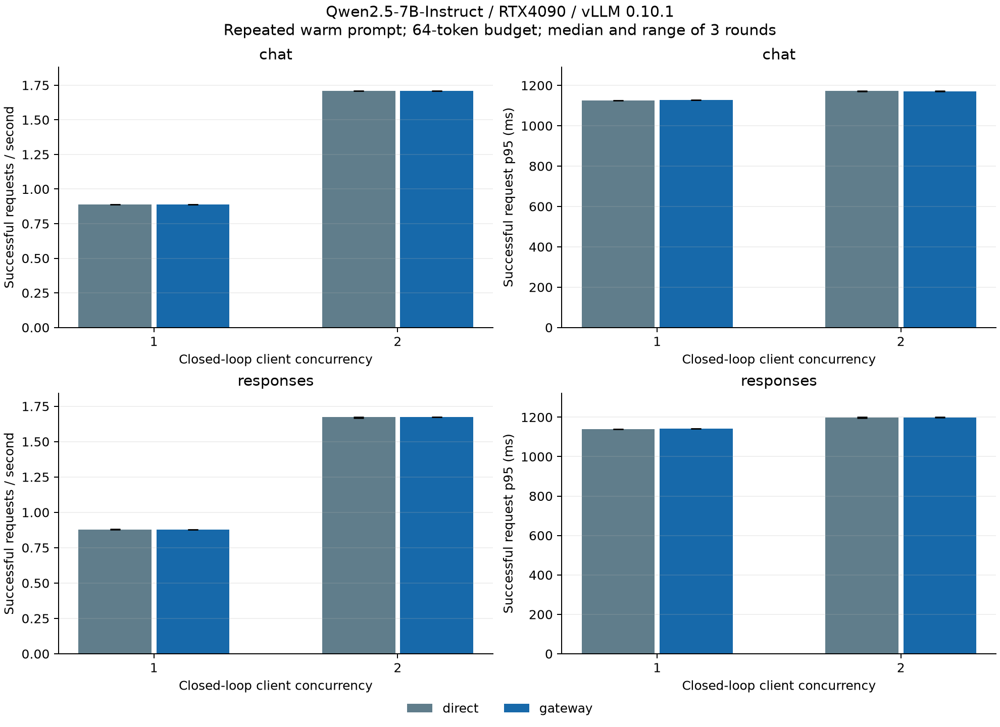

# M4.4 真实模型 benchmark

本报告比较同一原生协议的直连与网关；两种协议分别统计。

- 开始：2026-10-07T05:15:22.758655+00:00；结束：2026-10-07T05:34:27.551919+00:00。
- 24 个 case，1,200 次测量请求；每 case 50 次，预热 5 次，重复三轮。
- 有效成功：1200/1200。
- 请求、网关、模型都在 GPU 主机，通过 loopback；SSH 不在请求路径。

## 环境及工作负载

- GPU：NVIDIA GeForce RTX 4090, 24564 MiB, 550.54.14。
- Qwen2.5-7B-Instruct；vLLM 0.10.1+cu118 / PyTorch 2.7.1+cu118。
- V1、BF16、上下文 4096、max_num_seqs=2、显存比例 0.85、eager。
- prefix caching 和 chunked prefill 开启，重复相同 prompt，结果属于预热条件。
- 网关单 worker、单后端、全局容量 2；固定合法 key 的实验额度提高至 100,000，避免 key 配额干扰。
- 保留健康探测、完成日志、metrics 和 trace 埋点；不导出 OTLP。
- Chat temperature=0；Responses 使用后端默认 temperature=0.7。其他默认参数见环境证据。
- 两协议均为 64-token 输出上限；Responses 显式 store=false。

模型快照的下载 revision 未记录，配置哈希和权重文件大小已保存；不声称权重逐字节版本已核验。

## 成功吞吐与成功延迟

数值为三轮中位值，方括号为最小值至最大值，不是置信区间。

| 协议 | 并发 | 入口 | 成功 req/s [范围] | 成功 p50 ms | 成功 p95 ms [范围] |
| --- | --- | --- | --- | --- | --- |
| chat | 1 | direct | 0.890 [0.889, 0.890] | 1123.58 | 1126.15 [1125.96, 1126.45] |
| chat | 1 | gateway | 0.888 [0.888, 0.888] | 1125.66 | 1128.52 [1128.28, 1128.96] |
| chat | 2 | direct | 1.710 [1.709, 1.710] | 1168.79 | 1171.85 [1170.69, 1173.58] |
| chat | 2 | gateway | 1.710 [1.709, 1.710] | 1168.79 | 1170.81 [1170.63, 1173.81] |
| responses | 1 | direct | 0.879 [0.879, 0.880] | 1137.12 | 1140.16 [1138.13, 1140.29] |
| responses | 1 | gateway | 0.877 [0.877, 0.878] | 1139.43 | 1141.74 [1141.63, 1141.96] |
| responses | 2 | direct | 1.674 [1.665, 1.674] | 1193.97 | 1197.69 [1196.61, 1200.20] |
| responses | 2 | gateway | 1.674 [1.673, 1.674] | 1194.02 | 1199.17 [1197.33, 1201.07] |

## 输出与验收

| 协议 | 入口 | usage 有效样本 | 缺失 | 输出 token 均值 | 范围 |
| --- | --- | --- | --- | --- | --- |
| chat | direct | 300 | 0 | 64.00 | 64–64 |
| chat | gateway | 300 | 0 | 64.00 | 64–64 |
| responses | direct | 300 | 0 | 63.99 | 62–64 |
| responses | gateway | 300 | 0 | 64.00 | 63–64 |

成功要求 HTTP 200、正确协议/模型及非空文本；Responses 要求内部状态 completed。
Chat 的 finish_reason=length 也属于本次预算下的成功请求；文本可能截断。
所有测量网关请求的完成日志均按 trace ID 匹配，route 正确、attempt_count=1、
outcome=completed、cleanup_failed=false；每 case 结束后网关健康且 active=0。

## 解释边界

此结果覆盖短输入、固定输出上限、热 prefix cache 和并发 1/2。
单轮 50 样本的 p95 为探索性指标，不是生产 SLA。直连/网关分位数的差不能
当作每请求纯代理耗时；应结合三轮波动和输出 token 数判断。
Responses 含随机采样，不能把两种协议的延迟差解释为协议固有开销。
未测量冷 cache、长输入、流式首内容延迟、故障注入或超过容量的 GPU 性能。
Mac 上的 mock 实验与 Linux 上的真实推理使用不同硬件和后端，不能直接横向比较绝对吞吐或延迟。

## 证据

本地原始证据：`/Users/zemaochen/projects/infergate/artifacts/m4-benchmark/remote-20261007/real-01`。

正式目录包含 manifest、实际源码快照、逐请求响应/usage、预热、各 case 汇总和网关日志。
上层证据目录还保存环境、模型启动日志、两次小样本与最终清理记录。
首次小样本因工具错误要求日志 outcome=success
而失败；实际生成成功且网关记录 completed。修正工具并补回归后，小样本再次通过。
首次及修正后的小样本均单独保留，不计入正式性能汇总。

可随仓库保存的 [完整压缩证据](../evidence/benchmark-real-2026-10-07.tar.gz)，包含上述原始记录与失败小样本。

SHA256：`f900803ff6e06feda4d5a2b708e887fe823ee3e8d342df9a5f67d8d910e6d5c7`。
