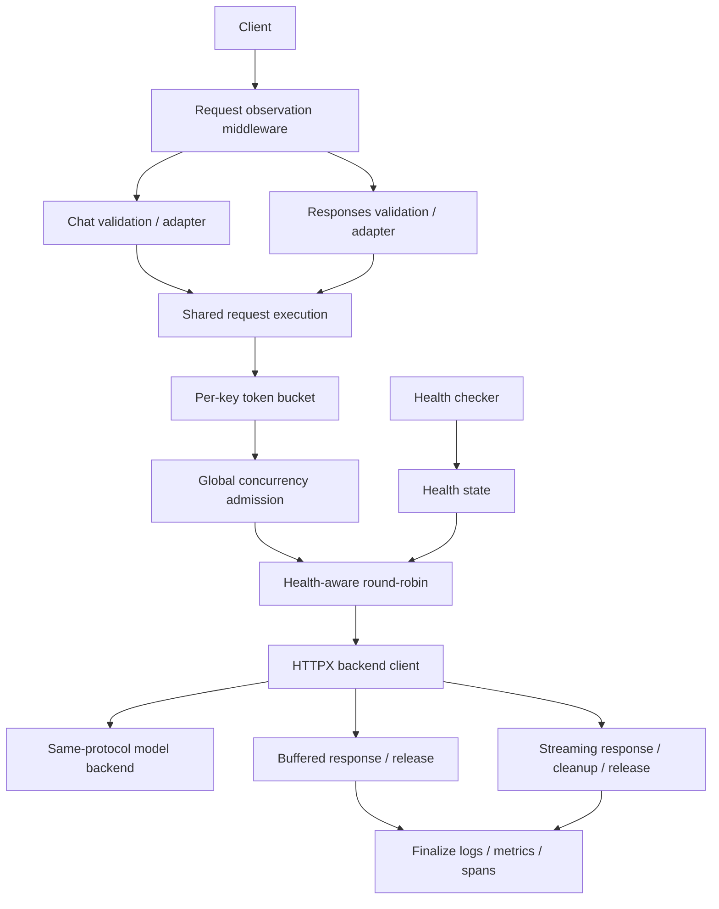

# Architecture

InferGate separates protocol adapters from routing, admission, backend transport,
and observation. The runtime entry point is `infergate.runtime:app`; the factory
is `create_runtime_app()`. The supported deployment uses one worker.

## Request path

The adapters supply the validated payload, model, backend path, and streaming
choice. They share one router, key limiter, concurrency limiter, backend client,
and observation lifecycle. Adding Responses did not create separate quotas or
capacity. Each request goes to the same protocol on its backend; the gateway
does not translate Responses into Chat.

## State and ownership

| Module | Responsibility and state |
| --- | --- |
| [runtime.py](../../src/infergate/runtime.py) | Freezes model, backend count/URLs, and OTLP configuration at app creation; owns separate inference/probe HTTP clients and startup/shutdown |
| [app.py](../../src/infergate/app.py) | Request models, thin adapters, shared execution, and buffered/streaming resource ownership |
| [router.py](../../src/infergate/router.py) | Model-to-backend lists and round-robin cursors; filters unhealthy and previously attempted backends |
| [health.py](../../src/infergate/health.py), [health_checker.py](../../src/infergate/health_checker.py) | Last probe result per backend; parallel startup/periodic probes with nonoverlapping rounds |
| [token_bucket.py](../../src/infergate/token_bucket.py) | Tokens and last refill time per key; default capacity 2, refill 1/s |
| [concurrency_limiter.py](../../src/infergate/concurrency_limiter.py) | App-wide occupied capacity; default limit 2 and no waiting queue |
| [backend_client.py](../../src/infergate/backend_client.py) | Same-protocol HTTP transport and retryable/nonretryable error classification |
| [observability.py](../../src/infergate/observability.py), [metrics.py](../../src/infergate/metrics.py), [tracing.py](../../src/infergate/tracing.py) | Request/attempt observations, app-owned registry/provider, completion logs, context propagation, and optional export |

Mutable routing and limiter updates are synchronous and contain no `await`
inside their state transitions. They are used within the app's event loop;
this is not a thread-safe or cross-process coordination mechanism. Multiple
workers would create independent copies of these states.

## Current limits

- **Process scope:** one worker; no shared quotas or health coordination across
  processes. Caller-supplied keys are quota labels, not authenticated identities.
- **Resource bounds:** concurrency and attempt counts are limited, but the key
  dictionary has no eviction. Buffered bodies and overall memory are not bounded
  by admission alone.
- **Time bounds:** HTTP operations use timeouts (connect/pool 5s, write/read 30s),
  but there is no total generation deadline. A continuously producing stream
  or stalled shielded close can retain a slot.
- **Protocol scope:** Chat supports ordinary and SSE responses; Responses is a
  text-only, non-streaming subset with explicit `store=false`. There are no
  stateful conversations, tools, multimodal support, or protocol translation.
  See [API reference](../reference/api.md).
- **Observation scope:** first-byte is not TTFT; no queue wait or reliable
  production token/s is measured. Backend internal scheduling and computation
  require backend instrumentation. OTLP delivery is best effort.
- **Validation scope:** controlled multi-backend behavior and real single-backend
  inference are separate checks. Long-running production stability, other
  routing policies, Kubernetes, and autoscaling were not evaluated.

For resource lifecycle and failure behavior, read
[Streaming and failures](streaming-and-failures.md). Individual decisions are
indexed in the [ADR log](../decisions/README.md). To start a process, use
[Run locally](../how-to/run-locally.md).
