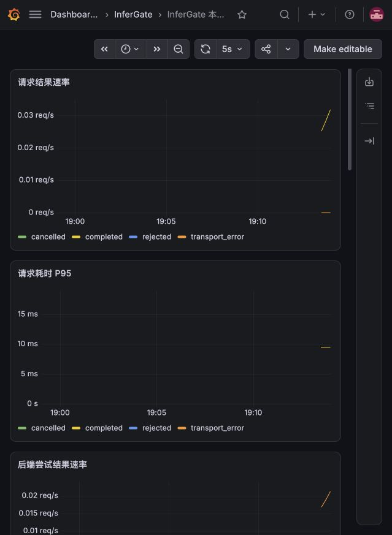
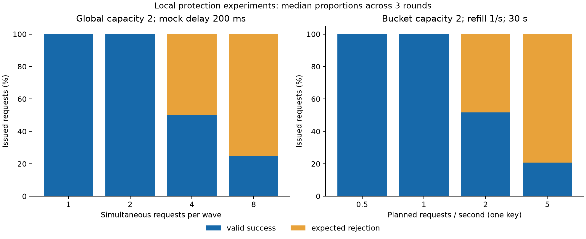

# Validation and recorded results

## First-version acceptance

The agreed single-process first version passed project acceptance on
**2026-10-08**. This section indexes dated results; it does not assert that every
check was rerun whenever this page changes.

| Check | Recorded result | Evidence |
| --- | --- | --- |
| Automated tests | 435 passed, two dependency deprecation warnings | [Project record](../evidence/acceptance/project-2026-10-08.json) |
| M2 actual loopback HTTP | Seven scenario groups passed | [2026-10-08 JSON](../evidence/acceptance/m2-2026-10-08.json) |
| M3 observation integration | Nine requests, ten attempts, final active=0; eleven provisioned panels | [2026-10-08 JSON](../evidence/acceptance/m3-2026-10-08.json) |
| Local container package | Linux ARM64, non-root UID 10001, Python 3.13.16; eleven business requests and cleanup passed | [2026-10-07 JSON](../evidence/acceptance/packaging-arm64-2026-10-07.json) |
| First hosted CI | Tests and Linux AMD64 packaging passed for `35c6902d096b8a36440a54b2a3364d5bfe0d8d4d` | [CI metadata](../evidence/acceptance/ci-2026-10-08.json), [packaging](../evidence/acceptance/packaging-amd64-2026-10-08.json) |
| Real Chat ordinary/SSE and stop/recovery | Qwen2.5-7B-Instruct, vLLM 0.8.5, one RTX 4090 | [2026-10-06 JSON](../evidence/acceptance/chat-backend-2026-10-06.json) |
| Native Responses and Chat regression | vLLM 0.10.1+cu118; temporary service stopped and prior Chat service restored | [2026-10-06 JSON](../evidence/acceptance/responses-backend-2026-10-06.json) |

The [project verification JSON](../evidence/acceptance/project-2026-10-08.json)
records the checked revision, test totals, and service results. The 2026-10-08 review did not
start a new GPU environment or repeat formal GPU measurements. Core source
identity was checked against the saved real-model experiment. Grafana provisioning
was rechecked; browser rendering evidence remains from 2026-10-05.

## Benchmark results

InferGate uses controlled HTTP experiments to check gateway behavior and
real-model experiments to compare direct and gateway access. These are separate
workloads on different machines. All results below refer to **2026-10-07**.

## Real-model comparison

The experiment used Qwen2.5-7B-Instruct on one RTX 4090 with vLLM 0.10.1+cu118,
BF16, a 4096-token context limit, and at most two model sequences. Client,
gateway, and model server ran on the same Linux GPU host over loopback.

The workload used a short repeated prompt, warm prefix caching, and a 64-token
output cap. The gateway ran one worker with global capacity 2 and one backend.
Key quotas were raised for this experiment to avoid confounding throughput with
rate-limit rejections. Health probes, completion logs, metrics, and tracing
instrumentation remained enabled; OTLP export was disabled.

Two protocols × two access paths × two concurrency levels × three rounds gave
**24 cases and 1,200 measured requests**, all meeting the experiment's success
criteria. Each case had 50 measurements after 5 excluded warmup requests.
The 1,200 total includes 600 direct and 600 gateway requests.

| Protocol | Concurrency | Direct successful req/s | Gateway successful req/s | Direct successful p95 ms | Gateway successful p95 ms |
| --- | ---: | ---: | ---: | ---: | ---: |
| Chat | 1 | 0.890 | 0.888 | 1126.15 | 1128.52 |
| Chat | 2 | 1.710 | 1.710 | 1171.85 | 1170.81 |
| Responses | 1 | 0.879 | 0.877 | 1140.16 | 1141.74 |
| Responses | 2 | 1.674 | 1.674 | 1197.69 | 1199.17 |

Values are medians of three per-round statistics. Per-round measurements,
output-token counts, and environment details are retained in the
[real-model data](../evidence/benchmarks/benchmark-real-2026-10-07.tar.gz).
The [redraw guide](../how-to/redraw-benchmarks.md) regenerates the full report
with min–max ranges and p50/p95 statistics.

Throughput was comparable between direct and gateway access within this
workload. This does not establish a general overhead percentage or production
capacity. A difference between p95 values is not the distribution of per-request
proxy overhead. Each round has only 50 samples, so p95 is exploratory.

Chat used temperature 0; Responses used backend-default temperature 0.7.
Compare direct versus gateway within each protocol, rather than interpreting
Chat/Responses differences as inherent protocol costs. Success required HTTP
200, the expected model/protocol, and nonempty generated text; Responses also
required completed status. Chat reaching its output cap counted as success,
so generated text could be truncated.

Cold caches, long inputs, streaming first-content latency, GPU overload,
fault injection during performance measurement, and long-running service
stability were not evaluated. The model download revision was not recorded;
configuration hashes and weight sizes do not prove byte-identical weights.

## Controlled local experiments

The local Mac ARM64 HTTP mock experiments covered **52 valid cases and 29,630
measured attempts**. Three experiment groups separated gateway overhead,
per-key quotas, and concurrency rejection. Raw rejections and failures were
retained; successful latency excluded them while success rates included issued
attempts.

| Experiment | Input | Observed median success rate |
| --- | --- | ---: |
| Key quota | 1 key at 0.5 or 1 request/s | 100% |
| Key quota | 1 key at 2 requests/s | 51.67% |
| Key quota | 1 key at 5 requests/s | 20.67% |
| Concurrency waves | 1 or 2 requests per wave, capacity 2 | 100% |
| Concurrency waves | 4 requests per wave, capacity 2 | 50% |
| Concurrency waves | 8 requests per wave, capacity 2 | 25% |

Quota saturation returned 429; concurrency saturation returned 503. Rejections
made zero backend attempts. Completed waves returned active capacity to zero,
and subsequent recovery requests succeeded. A separate order check verified
that concurrency rejection still consumes key quota.

The [local data](../evidence/benchmarks/benchmark-local-2026-10-07.tar.gz)
retains overhead measurements and per-round results for report regeneration. The client, gateway, and mock shared
one machine, so scheduler and HTTP overhead affect the measurements. Absolute
local mock numbers cannot be compared with Linux GPU inference numbers.

Two original quota cases were invalid because the arrival scheduler missed or
delayed sends beyond the predefined 100ms tolerance. Only those cases were
repeated; original records and exclusions remain preserved. The raw archives
include 29,837 local request records across original and replacement runs;
29,630 is the merged valid-attempt count, not the archive's total row count.

## Evidence index

- [Project verification](../evidence/acceptance/project-2026-10-08.json): checked revision, test totals, and acceptance scope.
- [Local benchmark data](../evidence/benchmarks/benchmark-local-2026-10-07.tar.gz): original and replacement runs, manifests, source snapshots, and request records.
- [Real-model benchmark data](../evidence/benchmarks/benchmark-real-2026-10-07.tar.gz): formal measurements, pilots, environment records, and logs.
- [SHA256 checksums](../evidence/SHA256SUMS): integrity of the published evidence and figures, using paths relative to the repository root.

Warmups and pilots are excluded from formal summaries. Current procedures live
in [Verify an installation](../how-to/verify-installation.md) and
[Redraw saved benchmarks](../how-to/redraw-benchmarks.md). Reading a record is
not the same as running its procedure. Results outside these workloads,
platforms, and dates require their own validation.
